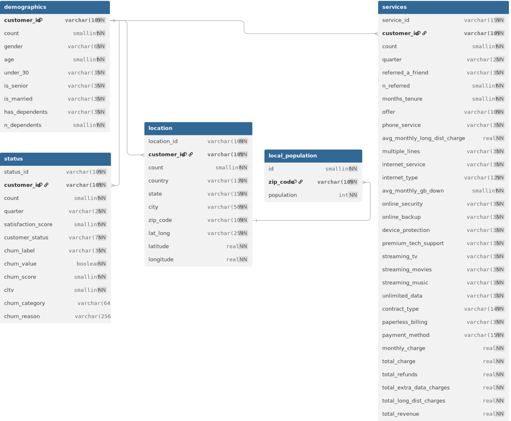

# Telco Company's Customer Churn Rate

This is an SQL and Pandas data analysis project.

The main aim of this project is to analyse the customer base of the given telco company.

The dataset was created by IBM and contains information about services provided to 7043 customers in California in Q3. A more detailed description is available on [IBM's website](https://community.ibm.com/community/user/blogs/steven-macko/2019/07/11/telco-customer-churn-1113).

The original dataset is provided by IBM in XLSX format. For the purpose of a more realistic analysis environment, the data has been moved into a PostgreSQL database inside a Docker container. The data entries were uploaded using pdAdmin. The schema is described in `schema.sql`.

